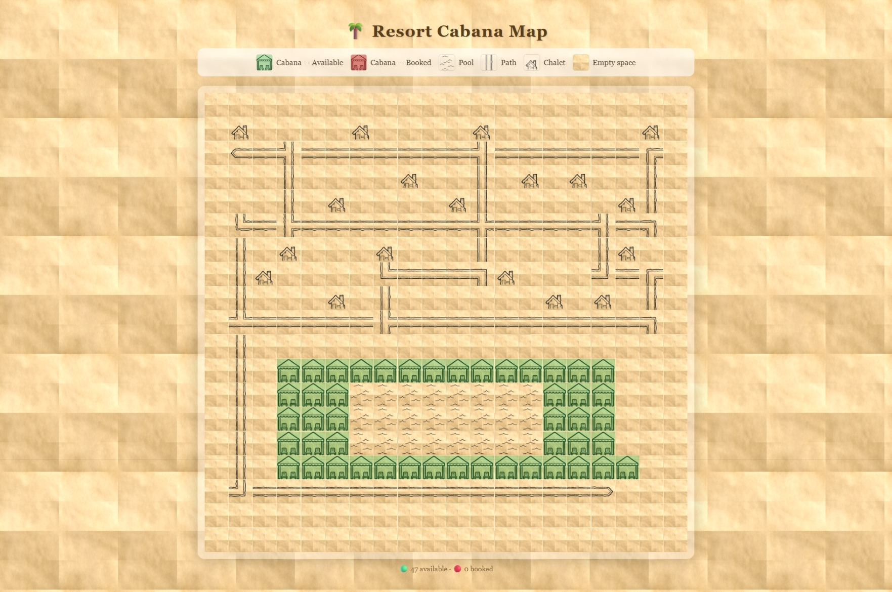

# 🌴 Resort Cabana Booking

Interactive cabana booking webapp for luxury resorts. Guests can browse
a visual map of the resort and book poolside cabanas in real time.

---

## Prerequisites

- [Node.js 20+](https://nodejs.org/)
- npm 9+

---

## Quick Start

```bash
# Mac / Linux
chmod +x run.sh
./run.sh

# Windows
.\run.ps1

# With custom files
./run.sh --map ./map.ascii --bookings ./bookings.json
```

| Service  | URL                   |
| -------- | --------------------- |
| Frontend | http://localhost:5173 |
| API      | http://localhost:5050 |

---

## Running Tests

```bash
# Backend (Jest + Supertest)
cd backend
npm test

# Frontend (Vitest + Testing Library)
cd frontend
npm test
```

---

## File Formats

### `map.ascii`

Plain text file — each character is one tile on the map:

| Symbol | Meaning |
| ------ | ------- |
| `W`    | Cabana  |
| `p`    | Pool    |
| `#`    | Path    |
| `c`    | Chalet  |
| `.`    | Empty   |

### `bookings.json`

A JSON array of hotel guests:

```json
[{ "room": "101", "guestName": "Alice Smith" }]
```

---

## API Endpoints

| Method | Path           | Description                            |
| ------ | -------------- | -------------------------------------- |
| GET    | `/api/map`     | Full map grid with cabana availability |
| GET    | `/api/cabanas` | Cabanas only with availability         |
| POST   | `/api/book`    | Book a cabana                          |

### POST `/api/book` body:

```json
{
  "cabanaId": "cabana-11-3",
  "room": "101",
  "guestName": "Alice Smith"
}
```

---

## Project Structure

```
resort-cabana/
├── map.ascii            ← Resort layout (ASCII art)
├── bookings.json        ← Hotel guest list
├── run.sh               ← Single start command (Mac/Linux)
├── run.ps1              ← Single start command (Windows)
├── assets/              ← Tile images (cabana, pool, path...)
├── backend/             ← Express API (Node.js + TypeScript)
│   └── src/
│       ├── index.ts         API routes + server startup
│       ├── mapParser.ts     Parses map.ascii into JSON tiles
│       ├── bookingService.ts In-memory booking logic
│       └── types.ts         Shared TypeScript types
└── frontend/            ← React app (Vite + TypeScript)
    └── src/
        ├── App.tsx
        ├── api.ts           Fetch calls to backend
        ├── index.css        All styles
        └── components/
            ├── ResortMap.tsx   Map grid + state
            ├── Tile.tsx        Single tile renderer
            ├── BookingModal.tsx Booking popup
            ├── Overlay.tsx     Modal backdrop
            └── Legend.tsx      Map key
```

---

## Design Decisions & Trade-offs

**Backend — Express + TypeScript:** Chosen for simplicity — three
endpoints, two service classes, no ORM or framework overhead.
`minimist` handles `--map` and `--bookings` CLI args cleanly.
Bookings are stored in a `Map<>` in memory since the spec
explicitly says no persistence is needed.

**Smart path tiles:** Each `#` tile looks at its 4 neighbors
to decide which image to use (straight, corner, T-split, crossing,
dead-end) and what rotation to apply. This gives the map a
natural, connected look without any manual tile labeling.

**Frontend — CSS Grid + layered images:** The map renders as a
CSS grid of `div` elements — one per tile. Each tile has three
image layers: parchment background, tile-specific image, and a
green/red tint for cabana availability. This approach is accessible
(keyboard navigable), easy to test with DOM queries, and requires
no canvas API.

**What was kept simple:** No WebSocket for live updates
(re-fetching on booking is enough), no persistent database,
no authentication beyond room number + name matching.

---

## Screenshot


